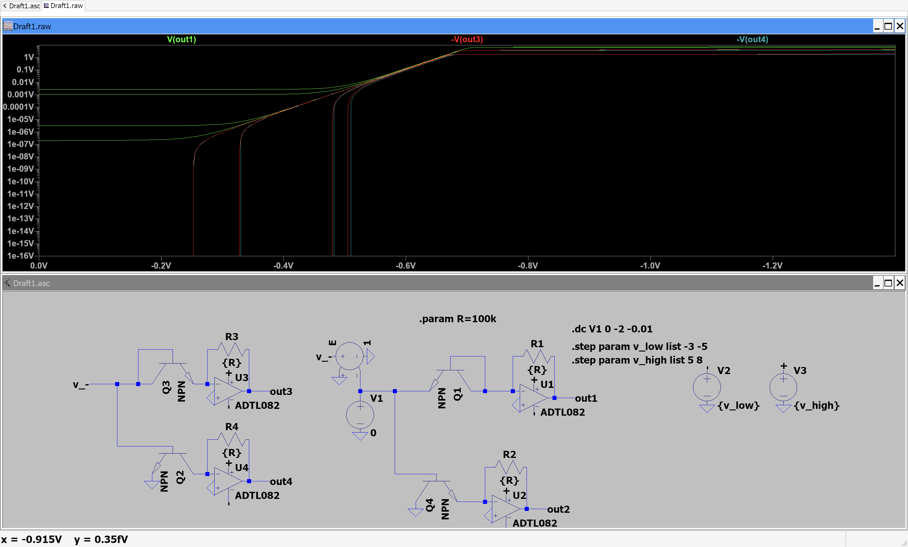
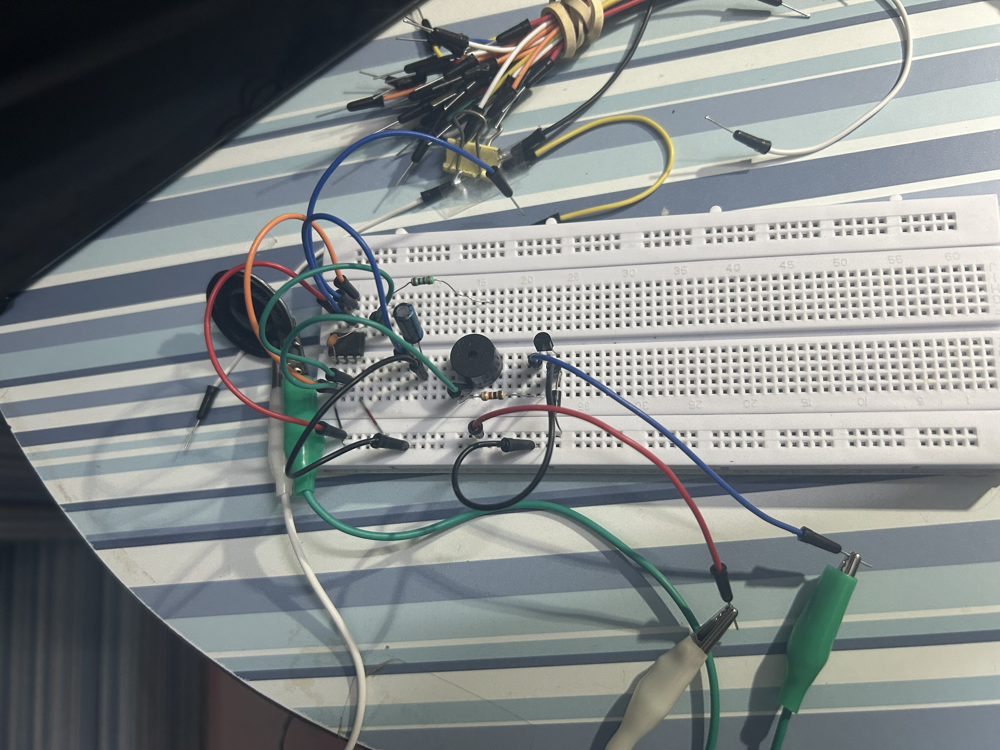
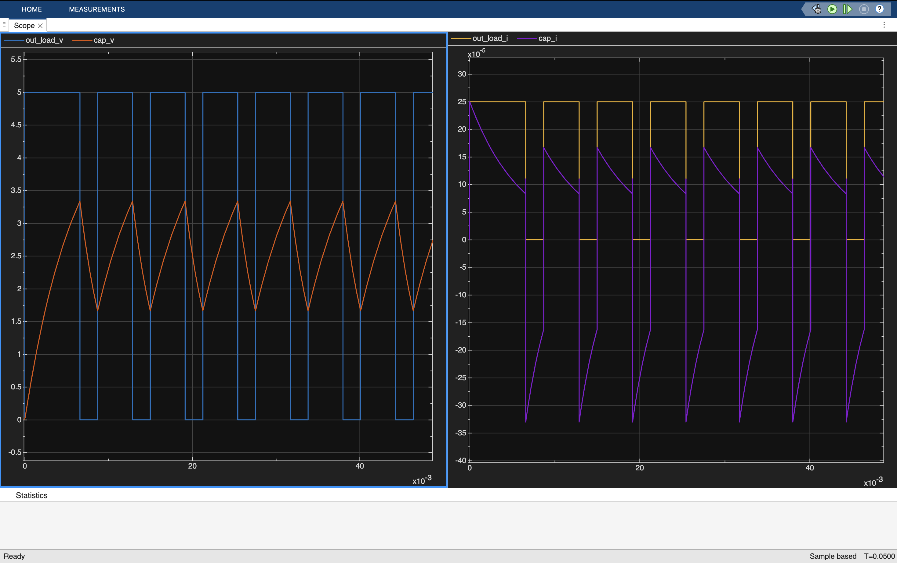
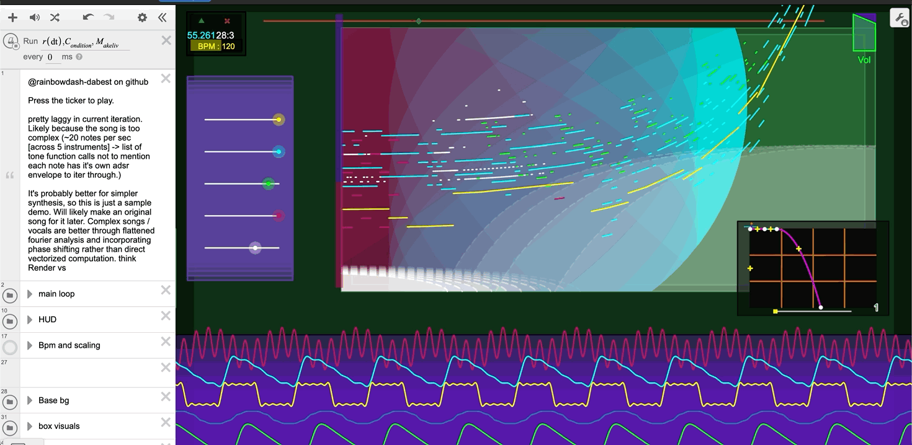
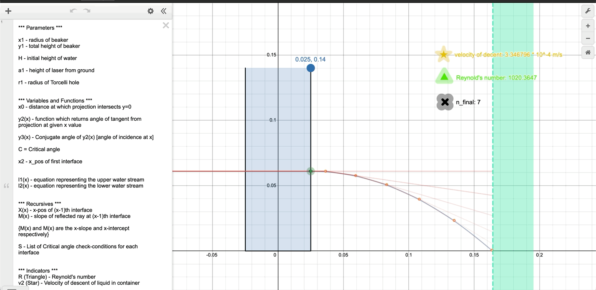
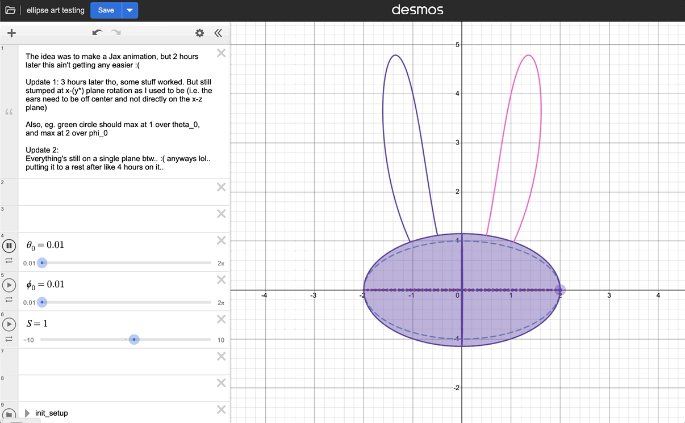
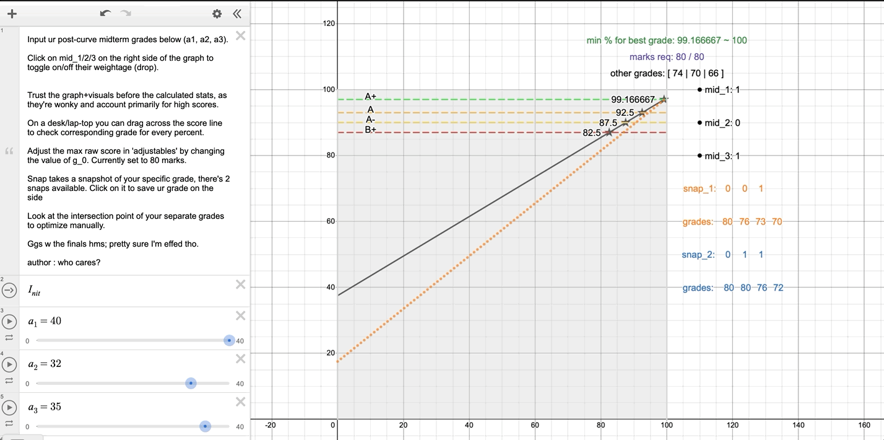

# Projects-and-stuff
A place to list out projects and stuff, obviously.

## Cad & Design

  
   
  
   

## Analog Electronics

  
    
    <small>Voltage controlled-Frequency Change in overall circuit</small>
  
  
    
    <small>LT SPICE simulating exp_converters</small>
  
   
  
    
    
    <small>basic stylophone with MATLAB chart</small>
  

## Desmos

  
    
     
    
     
  

## Python

## Digital Electronics