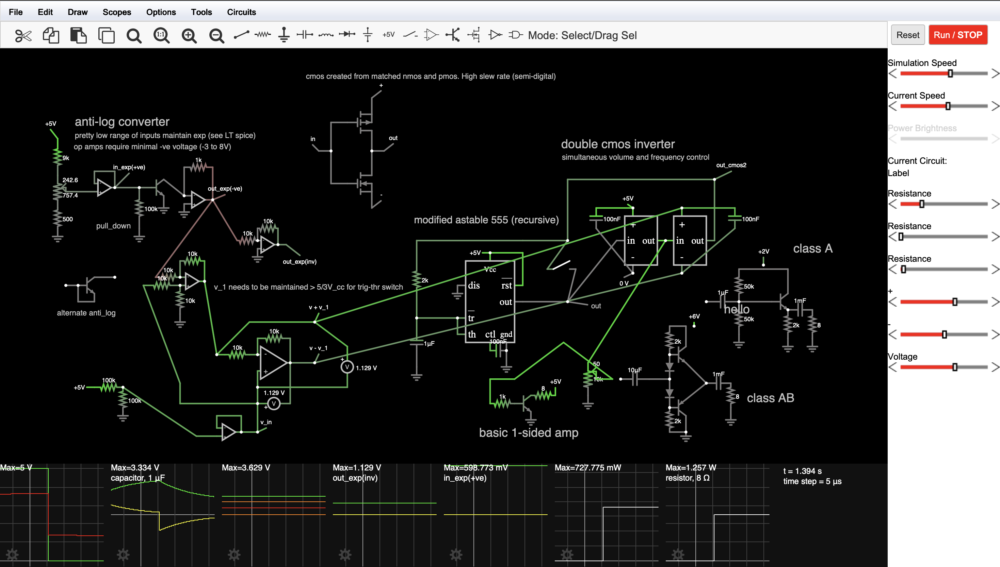

## ANALOG VCO - Stylophone
*[In progress]*

An analog exponential converter and op amp system that turns a NE555 into a multi-octave switching VCO with a stylophone input and simple amp output.

  
    
    <small>Overall Circuit</small>
  
   
  
    
    <small>LT SPICE simulating exp_converters</small>
  
   
  
    
    
    <small>basic stylophone with MATLAB chart</small>
  

I wanted to make a stylophone and the [fist NE555 model](https://www.instructables.com/A-Stylophone/) I saw had a pretty big (though not complicated) restriction. Since music scales exponentially, the resistor ladder that dictates the frequency modulation has to be non-linear.

What that means is that you need to design a separate circuit for every octave, and since i wanted to have a single set of notes which i could electronically move up and down, I was dissatisfied.
(+ I didn't have enough resistors for a dual octave)

So, I went ahead and designed a way to take a voltage from a ladder, feed it through a couple converters and op amps to get the input i want and turn the ne555-timer into a makeshift VCO. It might not match the EU Standard of 1V/octave (yet), but it allows for octave switching completely from the powered input wire, though currently a bit tgemperature unstable without a thermistor.

Currently testing on-hand chips, but otherwise ready for assembly.

#### Software:
LT Spice, Falstad, MATLAB (coz why not), Fusion 360.