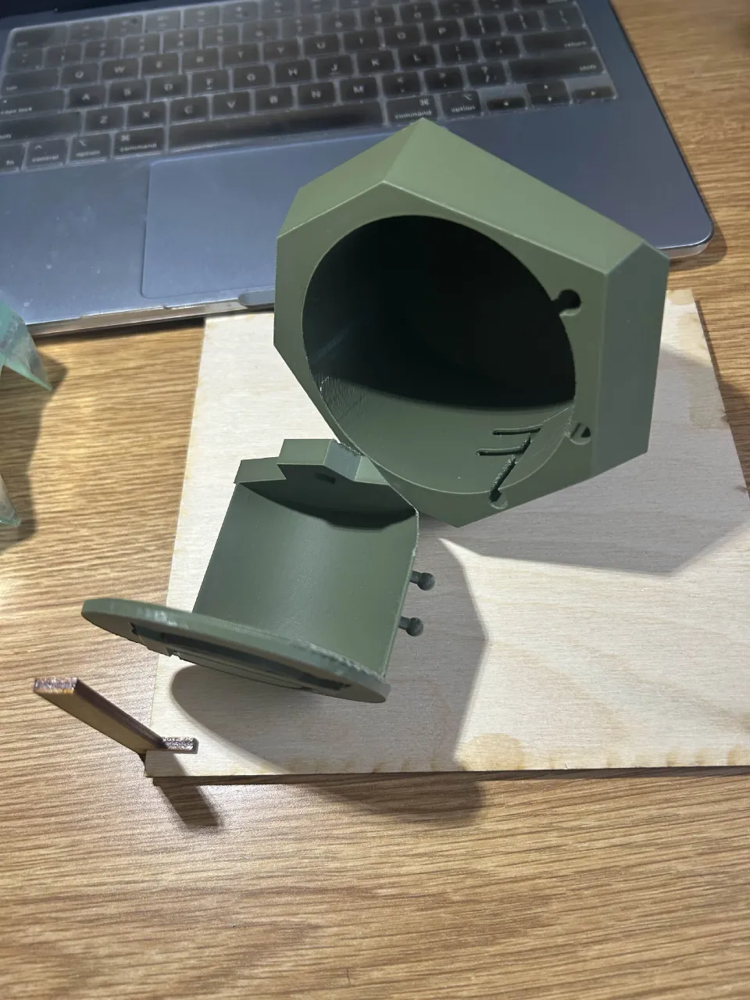

# CAD & Design

Love making random things, the student Fusion 360 subscription and UCLA's makerspace ecosystem helps that come to life.

Ongoing project: Kaeya Cosplay (Genshin Impact)

- Crown & Sword of Viego (League of Legends)
- Rayquaza lasercut 3D Card (Pokemon)
- Sliced Rayquaza Poseable Figurine (Pokemon)

  
   
  
   

## Crown and Sword - Viego (League of Legends)
Blade_Of_the_Ruined_King with a sword-in-the-stone mechanism secret compartment.\
Mechanism physically prevents the secret compartment from popping open when the sword is inserted while revealing a large space when the sword is extricated.
The crown itself fits the average head.

  
  
  
  

## 3D Pokemon card; Rayquaza.
  Laser cut model with multiple moddable layers. You can adjust the case by changing the hook sizes, and insert
  or remove layers however you want. Alternatives include a light-up diffuser, a transparent backed red Pokémon
  cover, as well as hollow and solid ply layerss. Stand is also lazercut.\
  (PS: there isn't any green in the entire
  model, the apparent color is exclusively additively colour-mixed from yellow and blue.)

  
    
    
  

## Sliced figurine; Rayquaza.
Just a sliced Rayquaza model with alternate plywood and green acrylic layers.
The cool thing about it tho is that you can rotate every slice about its axle. That's coz of how I designed
the dowels and nuts (friction snapfit acrylic). So you can pose the model and rotate it. Has a mini base too!

  
    
    
  

### Software
Fusion360, Blender, Adobe Illustrator, Procreate.