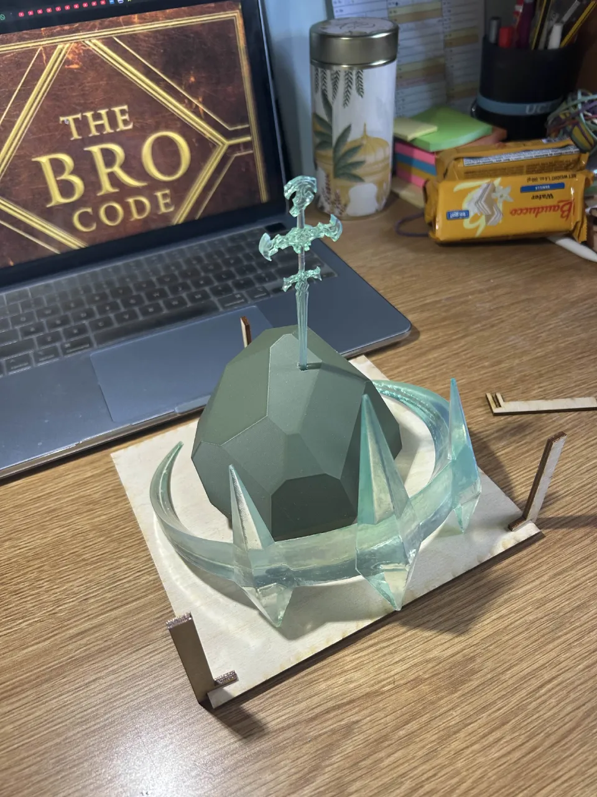
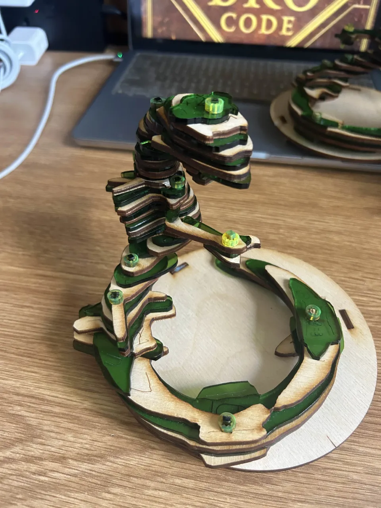
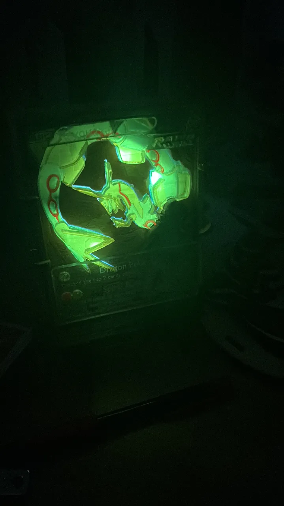

Loved making random things, the student Fusion 360 subscription and UCLA's makerspace ecosystem helped that come to life.

Software: Fusion360, Blender, Adobe Illustrator, Procreate.

Various things that made the list in 3d printing and lasercutting stuff.
Lots more to come, possibly w fabrics and stickers too
*{/said with a devious smile/}*...

    

