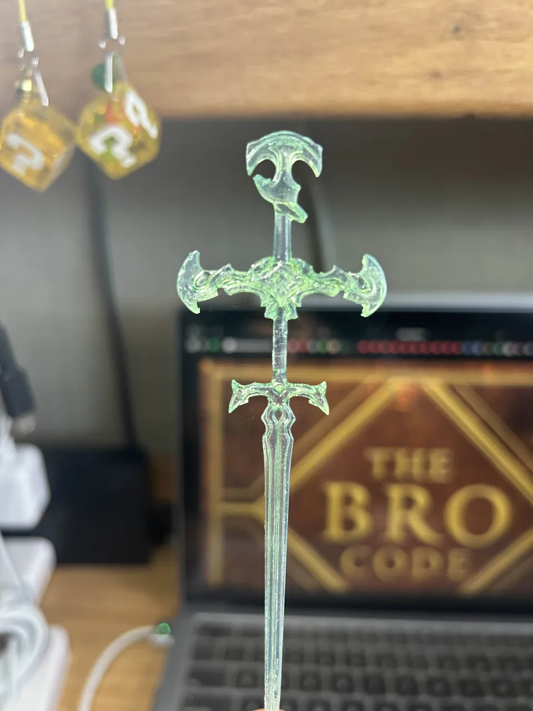
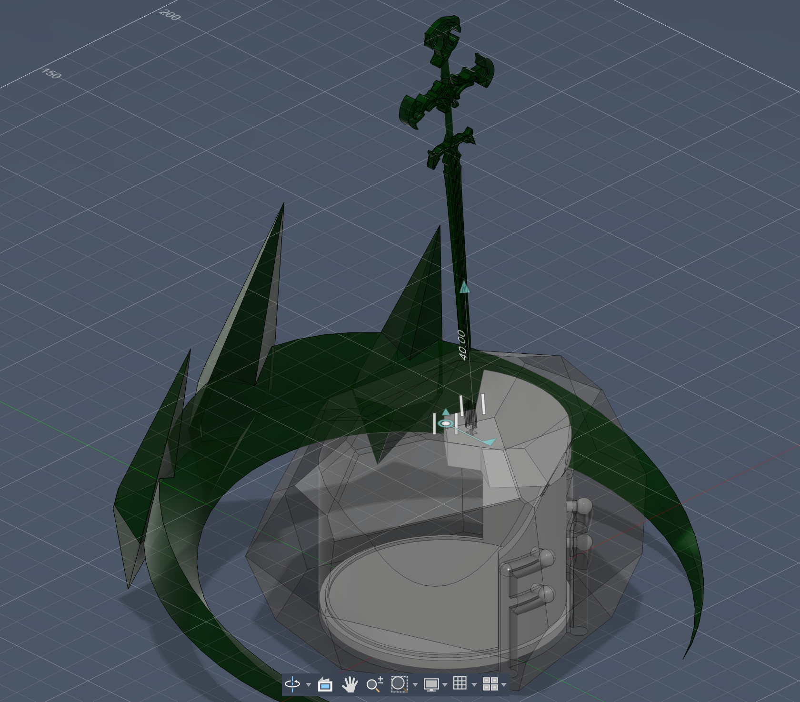

## Crown and Sword (Blade Of the Ruined King) of Viego (League of Legends) with a sword in the stone mechanism secret compartment.

Mechanism physically prevents the secret compartment from popping open when the sword is inserted while revealing a large space when the sword is extricated.
The crown itself fits the average head.

  
  

Created as a birthday gift because why not.
  
3D print; PLA and Clear Resin.\
Post processed with alcohol-based dye.

Designed on Fusion 360.

### Legal Disclaimer
This project is a piece of unofficial fan art and is not endorsed by, affiliated with, or associated with Riot Games. 
"League of Legends" and all associated logos, characters, names, and distinctive likenesses thereof are the sole property and trademarks of Riot Games, Inc. 
This 3D model has been created from scratch for personal, educational, and non-commercial use only, in accordance with Riot Games Legal Jibber Jabber policy.
