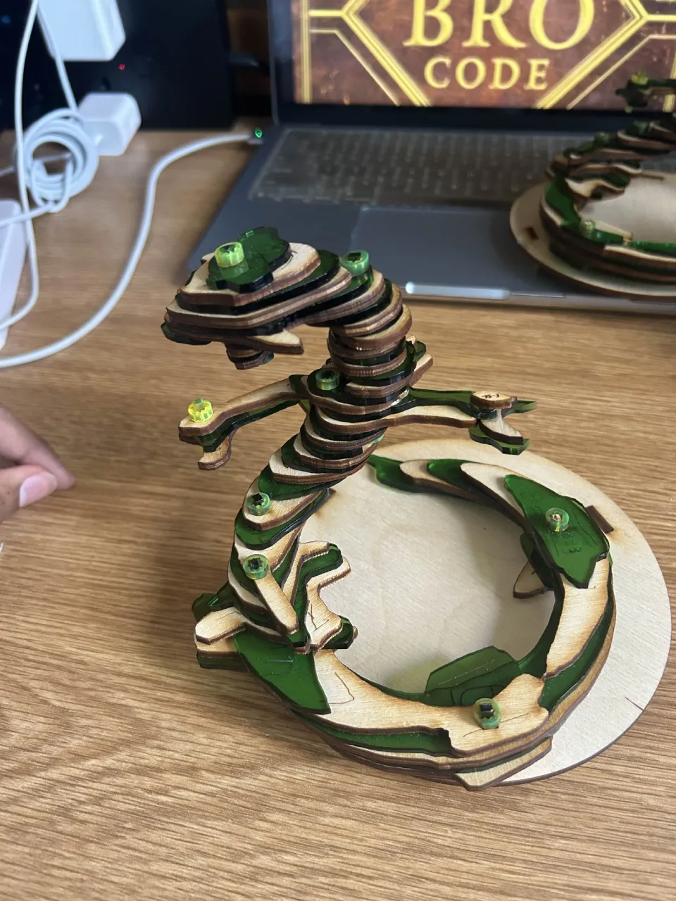
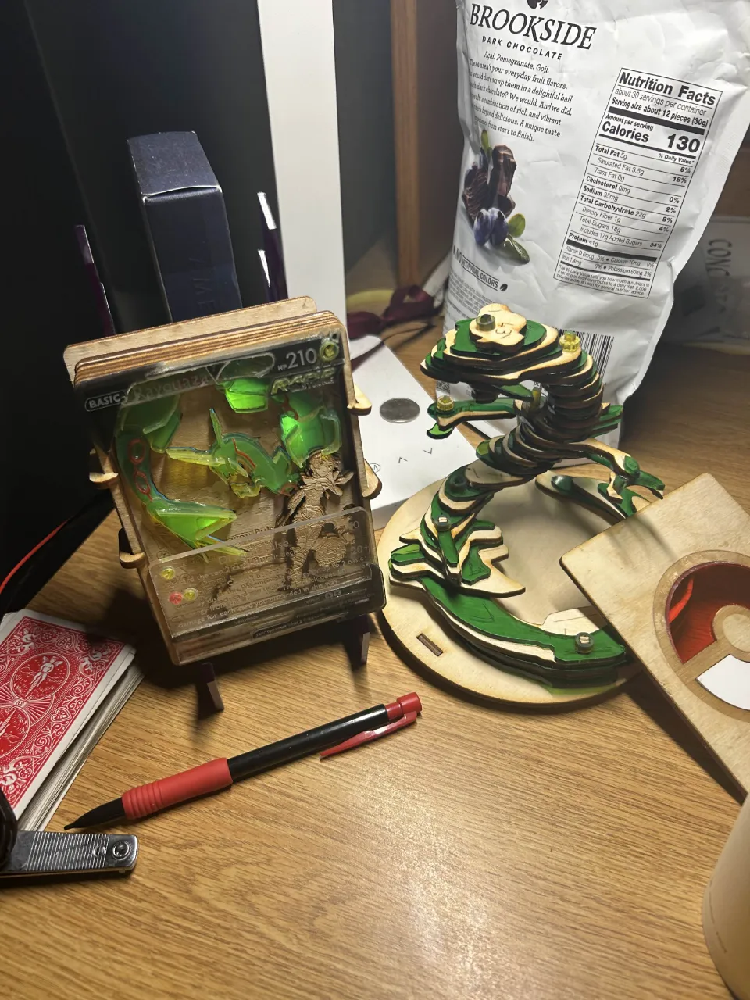

# Adjustable Sliced Rayquaza
Just a sliced Rayquaza model with alternate plywood and green acrylic layers.
The cool thing about it tho is that you can rotate every slice about its axle. That's coz of how I designed
the dowels and nuts (friction snapfit acrylic). So you can pose the model and rotate it. Has a mini base too!

Created as a birthday gift (same guy as the other rayquaza lol) because why not.

  
  

  
Laser Cut and doweled; Green Acrylic and 1/8" plywood

All dxf files were designed on Fusion 360 and arranged on Adobe Photoshop.\
Original STL model's credit goes to Theartistdt207, linked [here](https://cults3d.com/en/3d-model/art/rayquaza-theartistdt207).

### Legal Disclaimer
This project is a piece of unofficial fan art and is not endorsed by, affiliated with, or associated with Nintendo, Game Freak, and The Pokémon Company. 
"Pokémon" and all associated logos, characters, names, and distinctive likenesses thereof are not used for any commercial purpose.. 
This design spec has been created from scratch for personal, educational, and non-commercial use only.

### Fair Use Notice
This repository may contain copyrighted material the use of which has not always been specifically authorized by
the copyright owner. Such material is made available in an effort to advance understanding of artistic design and
development. This constitutes a 'fair use' of any such copyrighted material as provided for in section 107 of the US Copyright Law.