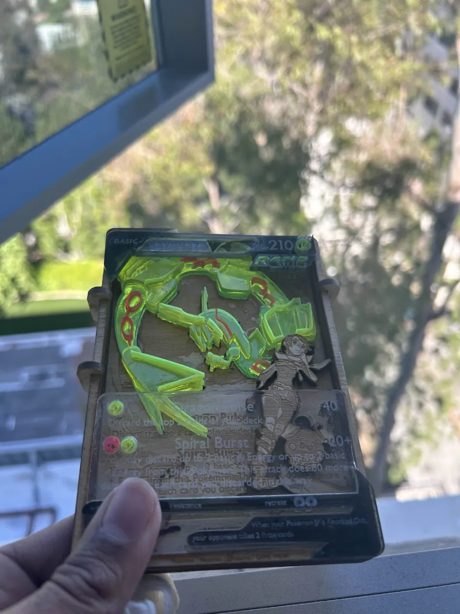
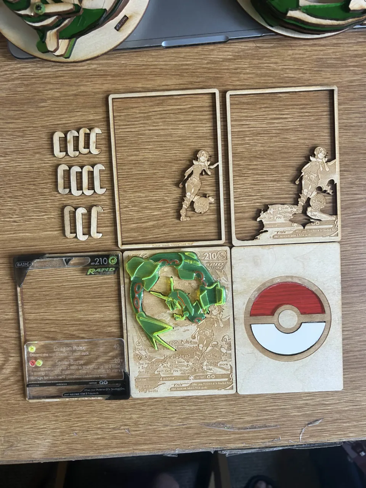

## 3D Pokemon card; Rayquaza.
  Laser cut model with multiple moddable layers. You can adjust the case by changing the hook sizes, and insert
  or remove layers however you want. Alternatives include a light-up diffuser, a transparent backed red Pokémon
  cover, as well as hollow and solid ply layerss. Stand is also lazercut.(PS: there isn't any green in the entire
  model, the apparent color is exclusively additively colour-mixed from yellow and blue.)

  
  

Created as a birthday gift because why not.
  
Laser Cut and Engraved; Clear, Red, Blue, Yellow Acrylic, 1/8" Plywood, 
couple LEDs, and basic soldering for the backlight.

All dxf files were designed on Fusion 360 and arranged on Adobe Photoshop.

### Legal Disclaimer
This project is a piece of unofficial fan art and is not endorsed by, affiliated with, or associated with Nintendo, Game Freak, and The Pokémon Company. 
"Pokémon" and all associated logos, characters, names, and distinctive likenesses thereof are not used for any commercial purpose.. 
This design spec has been created from scratch for personal, educational, and non-commercial use only.

### Fair Use Notice
This repository may contain copyrighted material the use of which has not always been specifically authorized by
the copyright owner. Such material is made available in an effort to advance understanding of artistic design and
development. This constitutes a 'fair use' of any such copyrighted material as provided for in section 107 of the US Copyright Law.