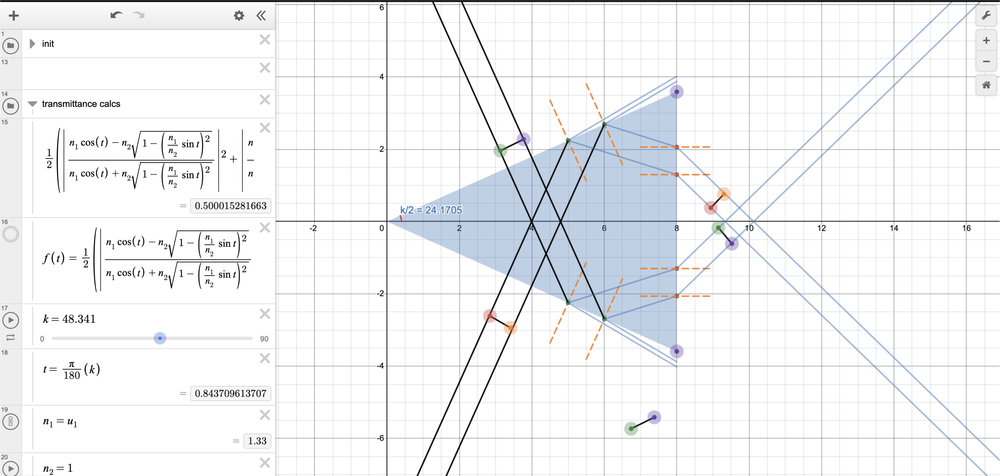

# Desmos (permalinks)

Desmos is pretty OP, and I've always found reducing visuals to their mathematical basis gives a hella better intuition than pre-made models.

Ongoing project: DAWsmusico

Here's a couple previews:
- DAWsmusico - the digital audio workstation
- Optical sim for Liquid Light propagation
- Rotating Bunny, because why not.
- Grade Distribution optimizer
 

  
    
     
    
     
  

Details below:

## DAWsmusico

Started this project cause I thought no one must've thought of making a DAW on desmos. Turns out I was pretty damn wrong, but guess I'm part of a weird community now.

Latest version supports Polyphony, MIDI imports, ADSR envelopes, multiple instruments, transisents.

The video game interface is in development but lag is a pretty big problem.

Latest (v laggy); Spectre; [vrs_10](https://www.desmos.com/calculator/2depjdklo1)

  
    
  

Driving in my car (Asgore meme); [vrs_3](https://www.desmos.com/calculator/9s6svth5te)

  <video src="Images_and_Gifs/driving_in_my_car.mp4" controls="controls" width="70%">
  </video>

Tetris; [vrs_1](https://www.desmos.com/calculator/lgvknwh6cw)

## [Audio-Visual additive synth](https://www.desmos.com/calculator/nhscqxwi6j)

https://github.com/user-attachments/assets/7585beb6-40d3-43a7-ac5a-f511bcc8298c

  <video src="Images_and_Gifs/fourier.mp4"
  controls="controls" width="90%">
  </video>

Assistant grapher to make instrument VSTs for DAWsmusico. Simple FFT visualizer with audio.

## [Parameters for Light Tunnel](https://www.desmos.com/calculator/asrdarklby)

  
    
  

Was designing a competion where students had to experiment on fluid light-tunnels. To make sure they didn't fudge the numbers too much, this simulator relates params and models a recurive fresnel curve to check TIR at projected incidence points. Fairly simple, but list iteration is no joke in desmos, needed some help from reddit too.

## [Prism patterns](https://www.desmos.com/calculator/y76gchi3qy)

  
    
  

I don't remember why I made it, but it's a basic light engine on desmos, that just uses Snell's laws on a modular prism. No complicated quantum stuff, just discrete algebra.

## [Rotating Bunny](https://www.desmos.com/calculator/1244uh8pqp)

  
    
  

Wanted to make an animation, but got lazy and left it at the 3d visualizer. Has bugs and I'm unlikely to improve it, but the bunny looks nice.

## [Spiteful Gradecheck](https://www.desmos.com/calculator/qfqromjgrt)

  
    
  

We had this one terrible math class (no names named), where we were given the **'choice'** to decide how many midterms to drop. So, I spitefully made a linear programming optimizer to compare scores and give students a breakdown of final marks necessary to get the grade you want.

I was the only one who used it probably.
