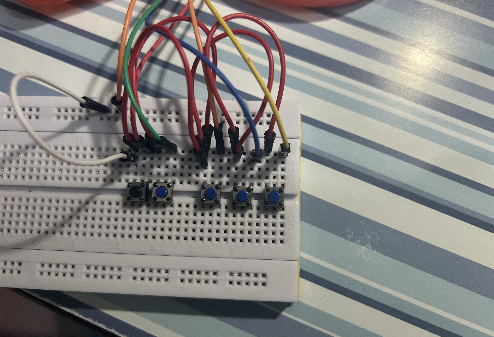

# Digital Electonics

Forced myself to learn the RP2040 C++ SDK for this. After a couple pointer related nightmares, this is my compensation ig.

LED config, Motor Handling, Basic PID, digital IO, basic I2S/UART protocols + a tiny bit of IK.

Ongoing project: Spinning Transparent Display

## 5 button macro-keyboard

  
    
    <small> Breadboard Circuit </small>
  

