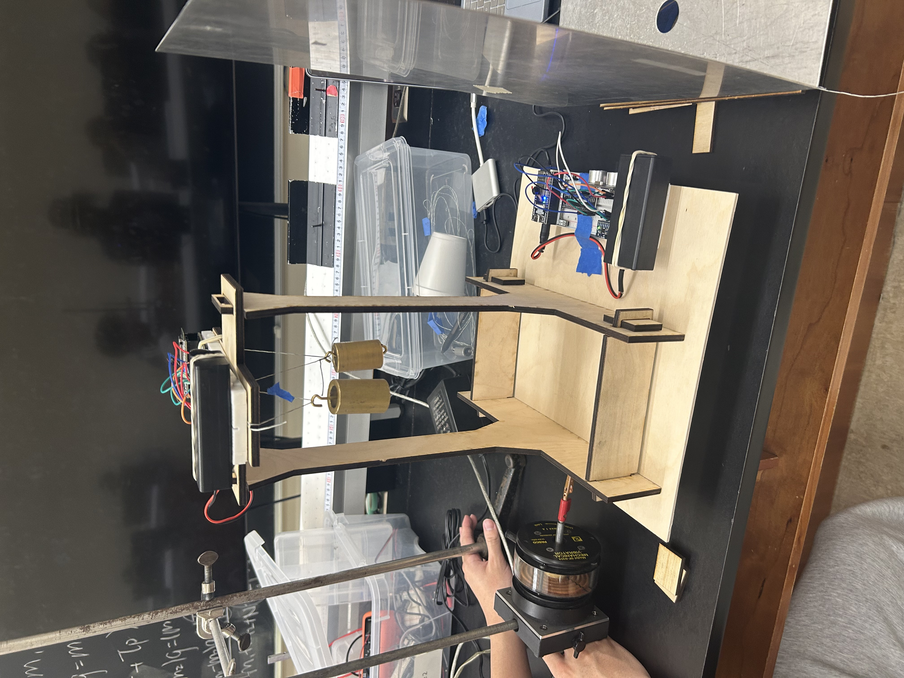
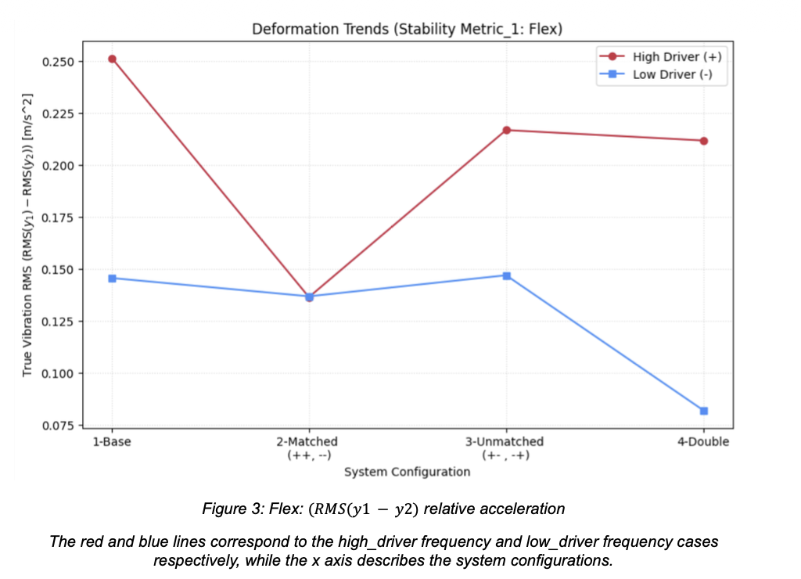
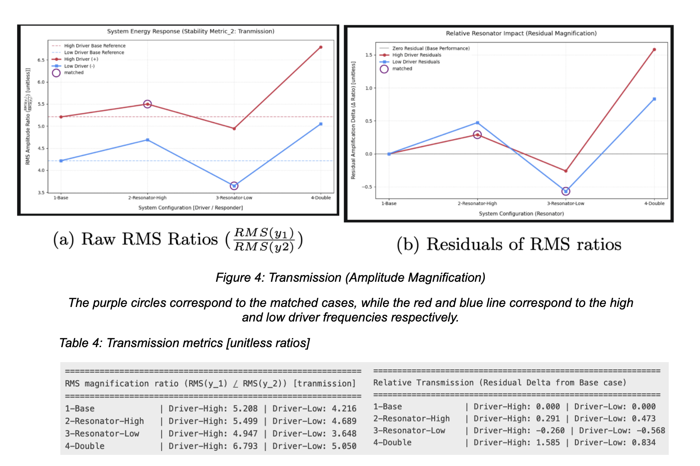
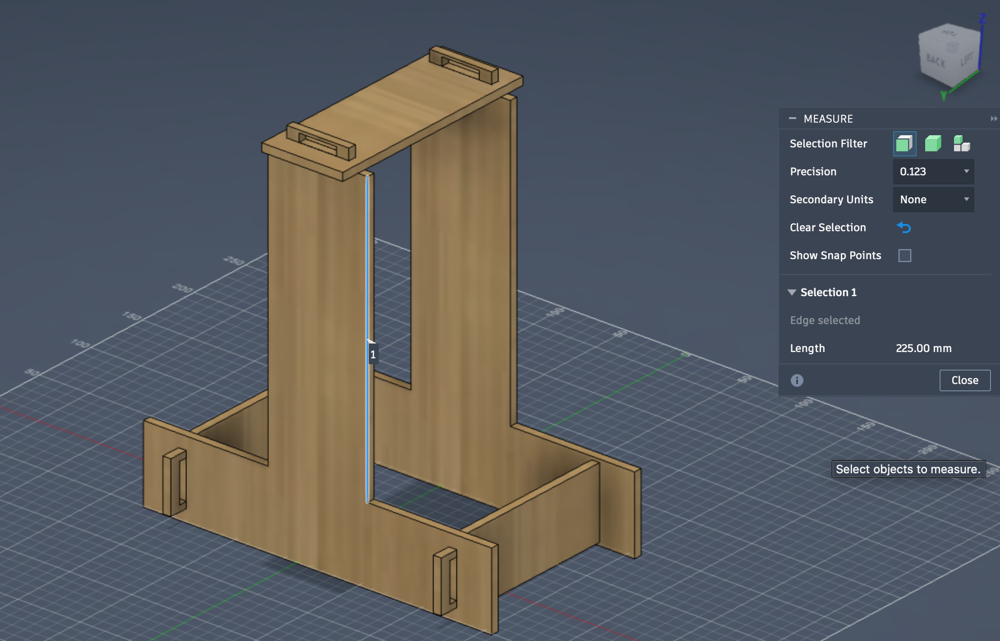
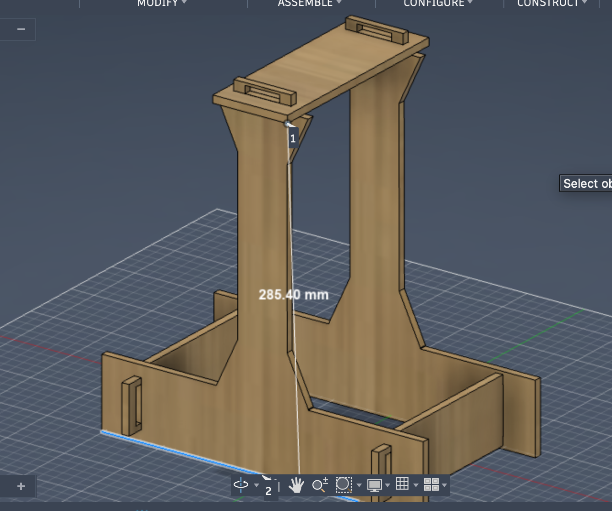
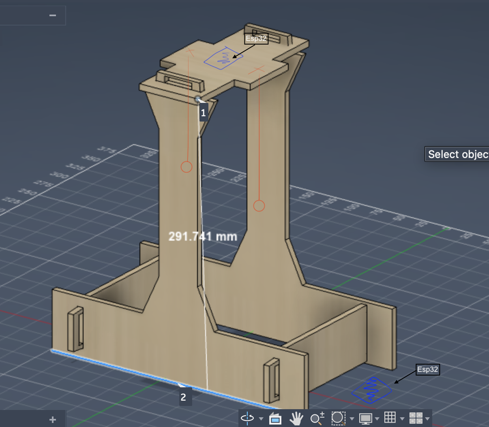
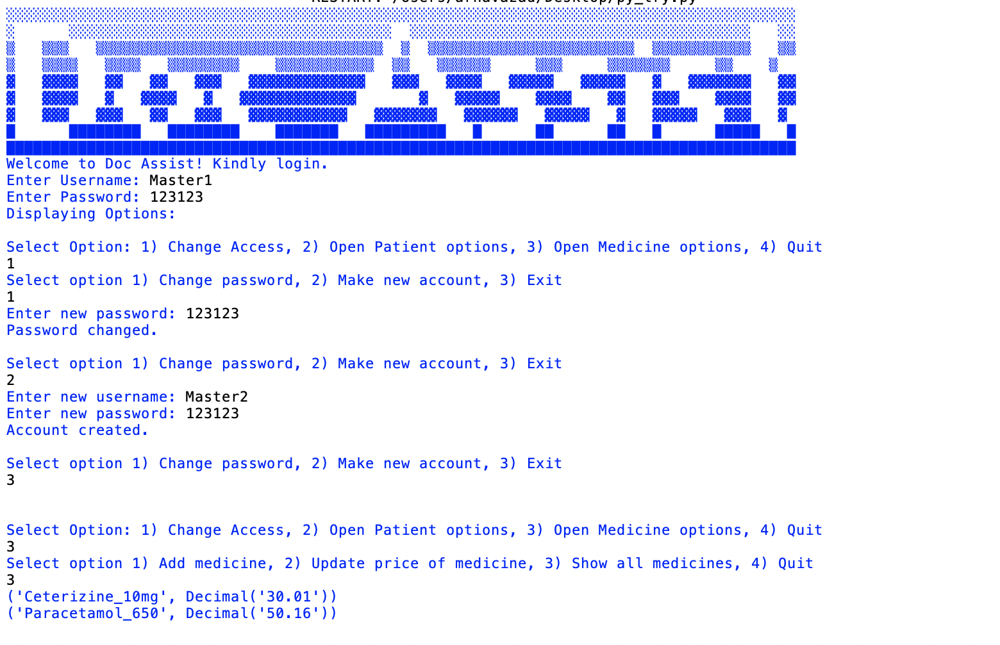
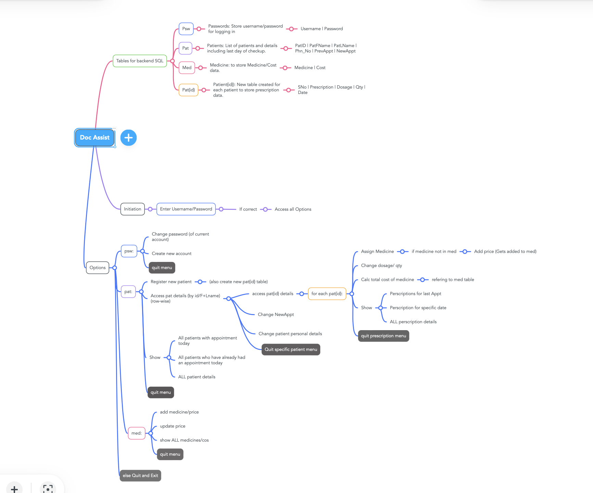
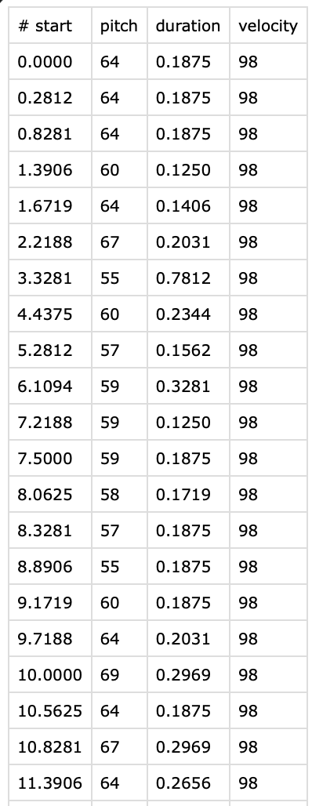

# Python

Been working with python for around 10 years (as of 2026), and mostly have direct use-case implements. Here's a couple that aren't too bad.

## 1. Multi-Tuned Mass Damper stability analysis

    
        
        
        <small>Setup and Flex metric</small>
    

    
        
        <small>Transmission_metric</small>
    

  
    
    
    
    <small>Design iterations</small>
  

## 2. Doc_Assist

A medically focused retro SQL-python interfacing project made in a time before AI.

  
    
    <small> Front_end </small>
  
  
    
    <small> Execution pipeline </small>
  

## 3. MIDI file processing and data extraction for desmos.

Needed to process midi files for desmos, so I wrote a short pretty_midi code for csv extraction.

  
    
    <small>midi parsed to csv</small>
  

